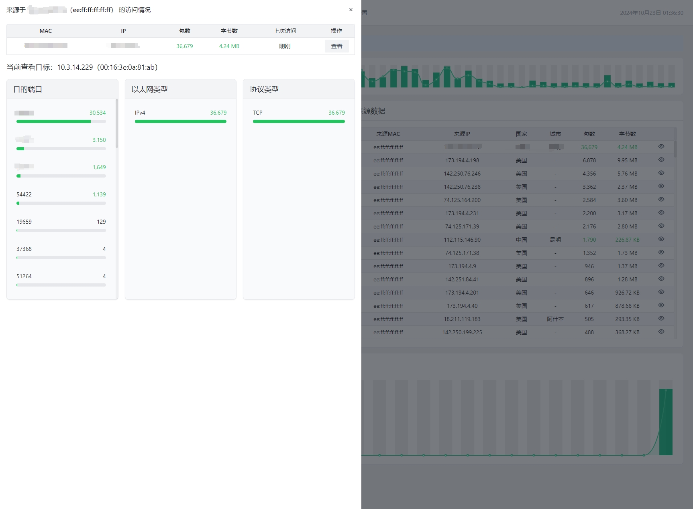

# eBPF Firewall

eBPF Firewall 是基于 eBPF 技术的高性能网络防火墙系统，具有实时入站流量监控、规则过滤和黑名单管理等功能。主要用于在资源有限的 VPS 中进行入站流量监控和过滤。

## 功能特点

- 基于 eBPF XDP 实现高性能数据包处理
- 实时流量监控和统计
- 灵活的规则配置和过滤
- 基于三层网络的IP、MAC 地址的黑名单管理
- 地理位置识别 (需要 [GeoLite2-City.mmdb](https://github.com/du5/geoip))
- 直观的 Web 用户界面
- 系统资源使用情况监控
- 占用资源极少，约 40MB 内存

## 截图





## 技术栈

- 后端: Go
- 前端: React, TypeScript, Tailwind CSS
- eBPF: C
- 数据可视化: ECharts

## 编译 & 运行

### 前置条件

- Go 1.23.2+
- Node.js 20+
- Linux 内核 5.8+ (支持 XDP， 目前仅测试了 Ubuntu 20.04、Ubuntu 22.04 Ubuntu 24.04、Debian 11、Debian 12)

### 编译

- 安装开发依赖

```bash
apt update && apt upgrade && apt install llvm clang libbpf-dev build-essential linux-headers-$(uname -r)

# 若出现asm/types.h引用错误，可使用下面命令：
ln -s /usr/include/x86_64-linux-gnu/asm /usr/include/asm
```

- 克隆仓库

```bash
git clone https://github.com/danger-dream/ebpf-firewall.git
cd ebpf-firewall
```

- 编译前端

```bash
cd web
npm install
npm run build
```

- 生成 eBPF 目标文件

```bash
cd ../internal/ebpf
go generate
```

- 编译

```bash
cd ../..
go build -o ebpf-firewall -ldflags="-s -w" -trimpath
```

### 配置

- 复制示例配置文件

```bash
cp config.example.yaml config.yaml
```

- 根据需要修改 `config.yaml` 文件（注：删除示例规则）。

### 运行

```bash
sudo ./ebpf-firewall
```

访问 `http://HOST:PORT` (PORT 为配置文件中设置的端口) 打开 Web 界面。

## 待开发...

- Web 界面规则配置、黑名单配置
- 数据持久化
- 基于 eBPF 的链路追踪
- 基于开源的恶意情报库自动阻断流量
- 异常消息推送

## 贡献

欢迎提交 Pull Request 或创建 Issue!

## 许可证

本项目采用 MIT 许可证。详见 [LICENSE](LICENSE) 文件。
